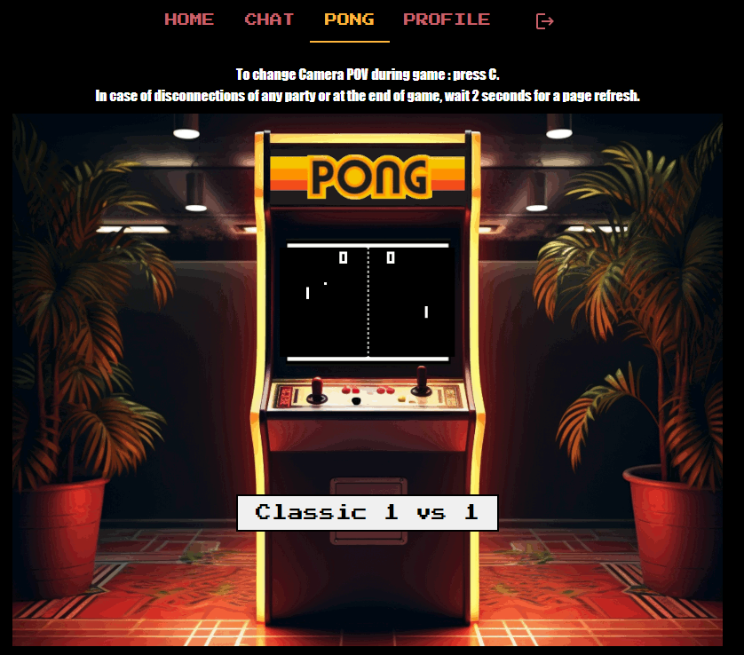

# 14-TRANSCENDENCE

Objectifs du projet :
- Containers avec Docker
- Frontend en typescript avec framework de notre choix. Ce projet a été réalisé avec React.
- Backend en NestJS. 
- Base de Données en postgresql. Ce projet a ajouté une couche Prisma.
- Éléments de sécurité en utilisant OAuth et 2FA.
- Mise en place d'un chat, à la IRC.
- Mise en place d'un pong, avec matchmaking et sur invitation.

Quelques Screenshots :

Réalisé par :
[Ana Silveira](https://github.com/anasilvr)
[Samuel Lord](https://github.com/pouliche777)
[Cesar Menjivar](https://github.com/cez20)
[Morgan Bertin](https://github.com/Mbertin44)
[Eric Wursteisen](https://github.com/OSS-42)
